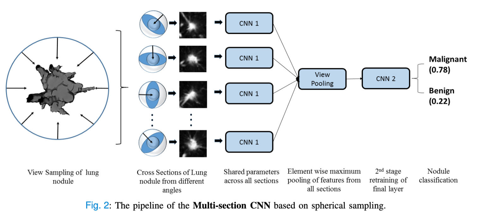

# MultiSectionCNN
Code for the paper "A Lightweight Multi-Section CNN for Lung Nodule Classification and Malignancy Estimation"

Network Architecture
--------------------

  

# Training
Code for generating the cross sections is shared in the notebook  
Stage 1 training is done by doing transfer learning using all the generated cross-sections.  
Stage 2 training is done on the maxpooled features for each cross-section.  
